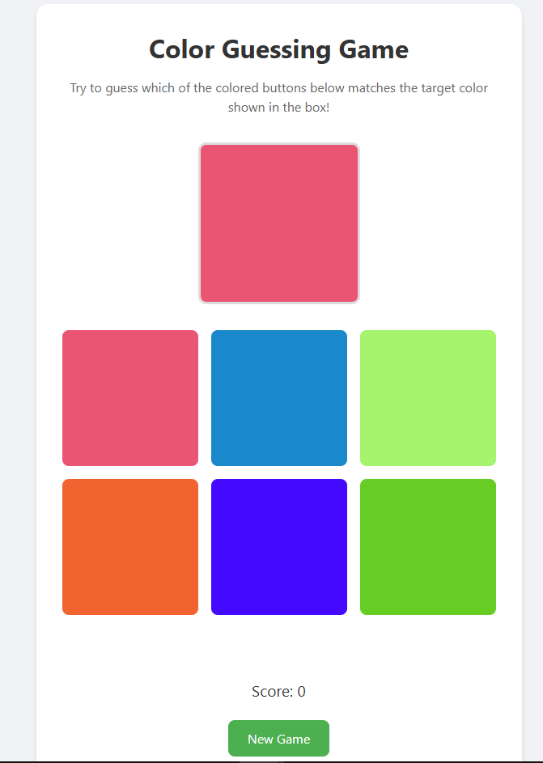

# 🎨 Color Guessing Game

This fun and interactive color guessing game built with vanilla JavaScript. Match the target color with the correct option



## 🎮 Game Features

- Random color generation for challenging gameplay
- Six color options per round
- Real-time score tracking
- Immediate visual feedback on guesses
- Responsive design for all devices
- Smooth animations and transitions
- New game functionality

## 🛠️ Technical Implementation

### Built With
- HTML5
- CSS3
- Vanilla JavaScript
```

## 🎯 How to Play

1. Look at the target color displayed in the box
2. Choose from six color options below
3. Click on the color you think matches the target
4. Get immediate feedback on your guess
5. Score increases with each correct guess
6. Start a new game anytime with the "New Game" button

## 📱 Responsive Design

The game is fully responsive and works on:
- 💻 Desktop computers
- 📱 Mobile phones
- 📟 Tablets


Project Live Link: (https://color-guess-game-hng.netlify.app/)

---

Created as part of the HNG Frontend Development Internship Stage One Task 